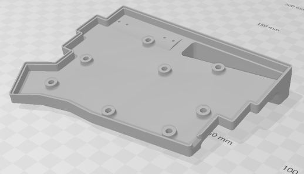

# Thumbsplit58 hardware
File archive for Thumbsplit58 keyboard PCB and case. You may also want to refer [Nordic MCU firmware](https://github.com/mohammedari/thumbsplit58-firmware) and [qmk_firmware](https://github.com/mohammedari/qmk_firmware/blob/oneoff/thumbsplit58/keyboards/thumbsplit58/) repository.

This repository only contains PCB gerber files for keyboard itself. 
You can use [Comet46's receiver gerber files](https://github.com/satt100/comet46-hardware.git) to make receiver for this keyboard.

## Top plates

Top plate DXF files are available under [dxf](dxf) directory.
This design is intended to be milled using 2mm endmill, 
but it should be manufacturable by laser cutters.

|                        | Left                                 | Right                                  |
| ---------------------- | ------------------------------------ | -------------------------------------- |
| rev1 (1u/1.5u support) |       |       |
| rev2 (1.5u only)       |  |  |

## Case

Case STL files are available under [stl](stl) directory.
This design is intended to be 3D printed using SLS or DLP printer.
It may be printable by FDM printers, but probably requires additional work.

|               | Left                                   | Right                                    |
| ------------- | -------------------------------------- | ---------------------------------------- |
| rev1 (CR2032) |       |       |
| rev2 (AA)     |  |  |

## Gerber files

Gerber files are available under [gerber](gerber) directory. 
These archives follow Fusion PCB's design guideline and output instruction.

## Schematics

- [Right half](schematic/thumb-split-right-v1.0.pdf)
- [Left half](schematic/thumb-split-left-v1.0.pdf)

## Parts list

TODO
